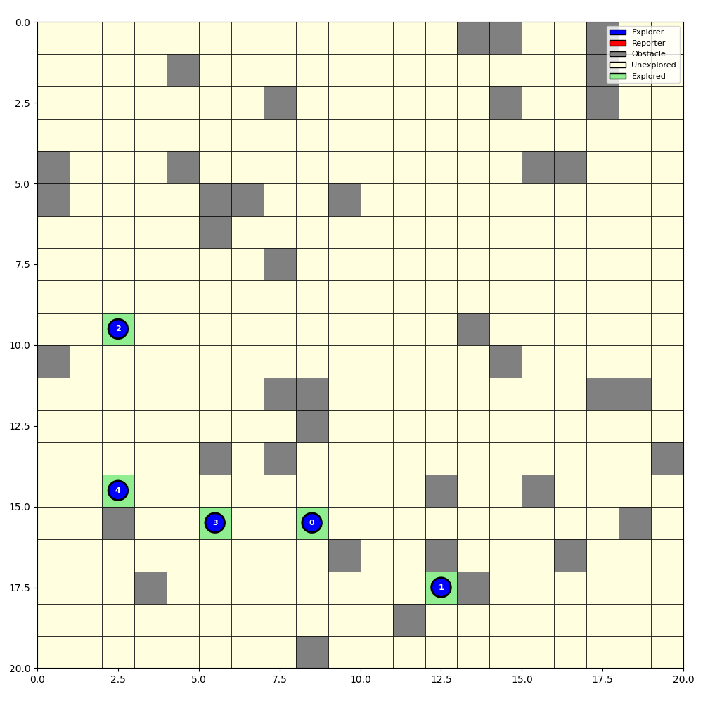

# Multi-Agent Reinforcement Learning for Swarm Robotics SAR

A complete Multi-Agent Reinforcement Learning (MARL) system for Search and Rescue (SAR) coordination in swarm robotics. The system implements QMIX with bio-inspired pheromone-based task allocation and configurable communication models.

## Features

- **PettingZoo Environment**: 2D grid world with configurable obstacles, communication denial zones
- **Bio-inspired Baseline**: Pheromone-based task allocation with fixed threshold
- **QMIX Implementation**: Custom implementation following EPyMARL patterns
- **Evaluation Metrics**: Coverage rate, steps to completion, communication cost

## Sample Walk 


## Installation

```bash
# Create virtual environment
python -m venv .venv
source .venv/bin/activate  # On Windows: .venv\Scripts\activate

# Install dependencies
pip install -r requirements.txt

## Configuration

The default configuration includes:

### Environment
- Grid sizes: 20×20, 30×30, 50×50
- Agent counts: 5, 10, 20
- Obstacle density: 15%
- Max steps: 200-1000 depending on size

### QMIX Training
- Learning rate: 5e-4
- Discount factor: 0.99
- Batch size: 32 episodes
- Replay buffer: 5000 episodes
- Target update: Every 200 episodes
- Epsilon decay: 1.0 → 0.05 over 50k steps

### Rewards
- α (coverage): 1.0
- β (step penalty): 0.01
- γ (communication cost): 0.1

## Running Tests

```bash
# Run all tests
pytest swarm_marl/tests/

# Run specific test file
pytest swarm_marl/tests/test_env.py -v
pytest swarm_marl/tests/test_qmix.py -v
```

## Key Metrics

- **C_R (Coverage Rate)**: Percentage of explorable area mapped
- **T_C (Time to Completion)**: Steps to reach 90% coverage
- **E_comm (Communication Energy)**: Total transmission count

## Citation

If you use this code in your research, please cite:

```bibtex
@software{swarm_marl_sar,
  title={MARL Swarm SAR: Multi-Agent Reinforcement Learning for Swarm Robotics Search and Rescue},
  year={2026},
  url={https://github.com/bsleit/swarm-MARL.git}
}
```
